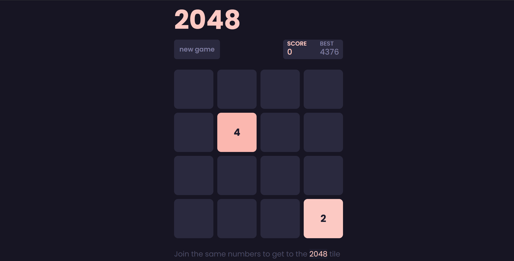
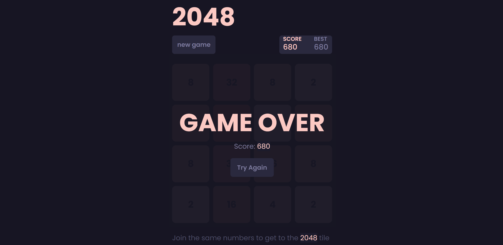

# 2024
My implementation of the popular 2048 game where you try to connect as many blocks of numbers as possible to reach the number 2048. I built it to practice responsive UI design, DOM manipulation, and JavaScript. The main focus was on creating a focused and minimalistic gameplay experience.  

 

## Features
- Fully playable in the browser
- Keyboard controls (arrow keys)
- Smooth tile animations (spawn, move, merge)
- Subtle screen shake animation when a move is not possible
- Score tracking (current and best)
- Responsive UI layout
- Game over screen
- New game button

 

 

## Technical Details
Built with HTML, CSS, and vanilla JavaScript. Key features include:
- Event listeners for user input (arrow keys)
- Game states for simulating moves and merges
- Local storage for tracking the best score
- Promises used for smooth tile animations
- Custom colour scheme that changes as tile values increase

## Possible future improvements
- Add touch controls for mobile
- Let user pick colour theme
- White mode (to match desktop preferences)

## How to Play
1. Open the game [here](https://filipek-0.github.io/2048/)
2. Use your arrow keys to move the tiles
3. Combine tiles with the same number to reach 2048
4. Try to achieve the highest score possible!

## Try it Yourself
All you need are your arrow keys and a bit of strategic thinking. Can you reach 2048?

 

